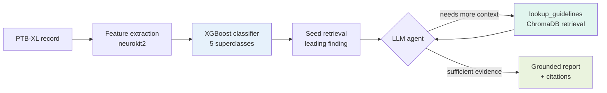
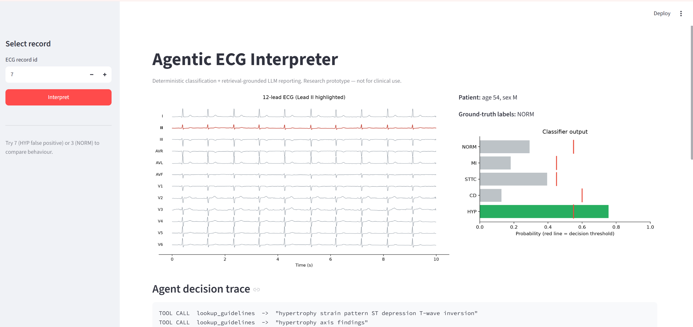
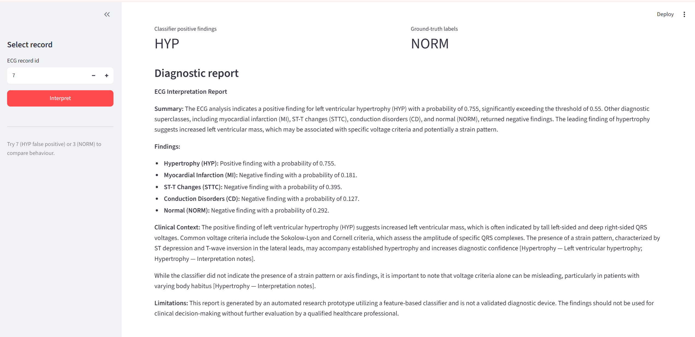

# Agentic ECG Interpreter

A hybrid AI system that interprets 12-lead ECGs end to end: it classifies
cardiac abnormalities with an interpretable model, retrieves relevant clinical
reference material, and generates a grounded, cited diagnostic report through
an auditable LLM agent.

> **Research prototype — not a validated medical device. Not for clinical use.**

---

## What it does

Given a raw 12-lead ECG from the [PTB-XL](https://physionet.org/content/ptb-xl/)
dataset, the system:

1. **Extracts physiologically meaningful features** — rhythm, heart-rate
   variability, and interval measurements (QRS, QT, PR) from Lead II, plus
   per-lead statistical descriptors across all 12 leads.
2. **Classifies** the ECG into five diagnostic superclasses (Normal, Myocardial
   Infarction, ST/T Change, Conduction Disturbance, Hypertrophy) using a
   one-vs-rest XGBoost model with per-class tuned thresholds.
3. **Retrieves** relevant passages from a cardiology knowledge base via semantic
   search.
4. **Generates** a structured diagnostic report through a LangGraph agent that
   grounds every clinical claim in retrieved evidence and cites its sources.

The design goal is **auditability**: a clinician can trace every step of the
agent's reasoning, from the deterministic classifier output to the specific
reference passages the report is built on.

---

## Architecture

The agent uses a **hybrid** design — a deterministic core that always runs in
fixed order, and an LLM-driven retrieval loop that adapts to each case.



**Deterministic core** (blue/green): feature extraction and classification
always run identically and reproducibly — the LLM cannot skip or alter them.
**Agentic layer** (purple): the LLM decides whether it needs additional clinical
context, issues its own retrieval queries, and writes the final report. Every
tool call is captured in an auditable decision trace.

---

## Results

Evaluated on the official PTB-XL test fold (fold 10), using the standard
stratified split so results are comparable to published benchmarks.

| Superclass | AUROC | F1 | Notes |
|------------|-------|-----|-------|
| NORM | 0.900 | 0.800 | Normal ECG |
| MI | 0.840 | 0.620 | Myocardial infarction |
| STTC | 0.872 | 0.644 | ST/T change |
| CD | 0.842 | 0.644 | Conduction disturbance |
| HYP | 0.881 | 0.581 | Hypertrophy (rarest class, 12%) |
| **Macro** | **0.867** | **0.658** | |

- **Validation macro AUROC 0.876 vs test 0.867** (gap 0.009) — no overfitting,
  attributable to the official stratified folds.
- Achieved with **~110 interpretable features and a shallow model**, within a
  few points of deep CNNs on raw signal (~0.89–0.93 in the literature) — a
  deliberate trade of raw AUROC for full interpretability.

### The model learned real cardiology

Feature-importance analysis of the MI classifier shows the top predictors
concentrate in the **inferior leads (II, III)** and **anterior leads (V1–V4)**,
plus the lateral leads (AVR, AVL) — precisely the lead territories cardiologists
use to localize infarction. The model recovered infarct localization from raw
per-lead statistics, rather than exploiting a dataset artifact.

---

## Installation

Requires Python 3.10+.

```bash
git clone https://github.com/Salako07/Agentic-ECG-Interpreter
cd Agentic-ECG-Interpreter
python -m venv venv
venv\Scripts\activate        # Windows
# source venv/bin/activate   # macOS/Linux

pip install -r requirements.txt
```

On Windows, if `torch`/`torchvision` are troublesome, install the CPU build
first:

```bash
pip install torch torchvision --index-url https://download.pytorch.org/whl/cpu
pip install -r requirements.txt
```

Set your OpenAI API key in a `.env` file at the project root:

```
OPENAI_API_KEY=sk-...
```

---

## Data access

PTB-XL is **open access** — it requires a free PhysioNet account but no
credentialing. Download the 100 Hz records and metadata:

```bash
python download_data_s3.py     # via PhysioNet S3 mirror (recommended)
# or
python download_data.py        # via physionet.org (has a documented workaround)
```

> **Note:** the standard `wfdb.dl_database()` crashes on PTB-XL due to a missing
> newline in the dataset's RECORDS file, and physionet.org's file endpoints
> intermittently return 500/502 errors. Both download scripts work around these
> issues; the S3 mirror route is the most reliable. See `ENGINEERING_LOG.md`
> (B-001, B-002) for details.

---

## Usage

### Build the pipeline (one-time)

```bash
python extract_all.py                 # feature matrix (21,799 records)
python -m src.classifier.model        # train + save the classifier
python -m src.rag.ingest              # build the guideline vector store
```

### Interpret an ECG (CLI)

```bash
python -m src.agent.graph 7           # full agent run on record 7
```

Prints the decision trace, classifier findings, ground-truth labels, and the
generated report.

### REST API

```bash
uvicorn src.api.main:app --reload
```

Then visit `http://localhost:8000/docs` for interactive API documentation.
`POST /interpret` with `{"ecg_id": 7}` returns the classification, report, and
tool-call trace as JSON.

### Visual UI

```bash
streamlit run app/streamlit_app.py
```

Shows the 12-lead waveform, classifier probabilities against their thresholds,
the agent's decision trace, and the grounded report — on one screen.

---

## Project structure

```
Agentic-ECG-Interpreter/
├── download_data.py            # PTB-XL downloader (physionet.org route)
├── download_data_s3.py         # PTB-XL downloader (S3 mirror route)
├── extract_all.py              # batch feature extraction -> parquet
├── requirements.txt
├── ENGINEERING_LOG.md          # design decisions, bugs, tests, results
├── src/
│   ├── ecg/
│   │   ├── loader.py           # PTB-XL loading + SCP->superclass mapping
│   │   └── features.py         # neurokit2 feature extraction
│   ├── classifier/
│   │   └── model.py            # one-vs-rest XGBoost + evaluation
│   ├── rag/
│   │   ├── knowledge_base/     # author-written cardiology reference (6 docs)
│   │   ├── ingest.py           # chunk + embed -> ChromaDB
│   │   └── retriever.py        # semantic retrieval interface
│   ├── agent/
│   │   ├── tools.py            # deterministic classifier core + tools
│   │   └── graph.py            # LangGraph hybrid agent
│   └── api/
│       └── main.py             # FastAPI service
└── app/
    └── streamlit_app.py        # visual demo UI
```

---

## Design notes

Every non-trivial decision — from why interval durations use the `peak`
delineation method, to why unlabeled records are excluded from the benchmark,
to why the RAG corpus is author-written rather than scraped from copyrighted
guidelines — is documented with its rationale and supporting evidence in
[`ENGINEERING_LOG.md`](ENGINEERING_LOG.md).

A few highlights:

- **Physiological validation.** A systematic QRS-inflation error was caught by
  sanity-checking extracted intervals against known physiology, then fixed and
  validated against simulated ECG with known heart rates.
- **Interpretability by design.** The feature-based classifier is fully
  explainable, supporting the auditability goal better than a black-box model.
- **Copyright-clean knowledge base.** The cardiology reference is written from
  scratch in original prose, making the repository freely shareable and
  demonstrating domain competence.

---

## Knowledge base disclaimer

The cardiology reference in `src/rag/knowledge_base/` is original, educational
reference material covering standard, textbook-level ECG interpretation. It is
**not** a substitute for current clinical guidelines and contains no copyrighted
guideline text. This system is a research prototype and must not be used for
clinical decision-making.

---

## Demo




## License

MIT — see [LICENSE](LICENSE).

## Acknowledgements

- [PTB-XL](https://physionet.org/content/ptb-xl/), Wagner et al., via PhysioNet
- [neurokit2](https://github.com/neuropsychology/NeuroKit) for signal processing
- Built with XGBoost, ChromaDB, sentence-transformers, LangGraph, and FastAPI